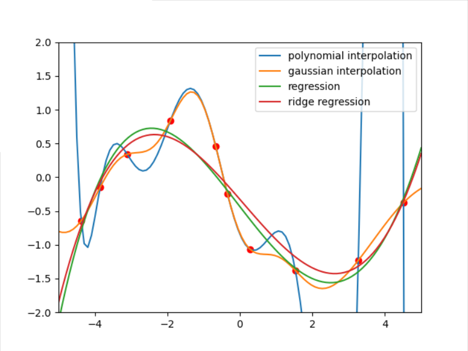
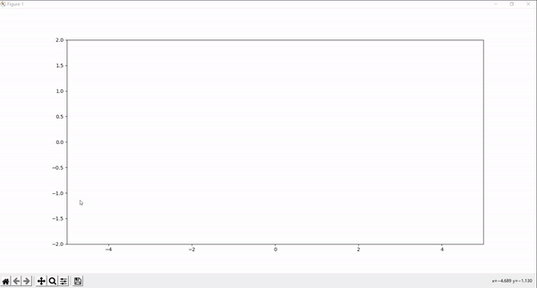
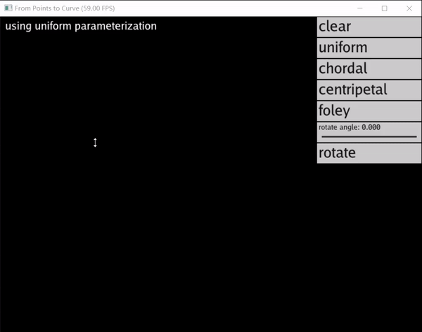

## GAMES 102
Assignments of GAMES 102. Website of GAMES 102: [Geometry Modeling and Processing](http://staff.ustc.edu.cn/~lgliu/Courses/GAMES102_2020/default.html).
### Assignment 1
Use python to implement polynomial interpolation, gaussian interpolation, polynomial regression and ridge regression. Type command:
```
python fit.py
```
It will eject a window that you can put your own points. After setting your points,  close the window. It will eject another window that shows the fitting results with different colors. The results will be like:



### Assignment 2
Use pytorch to build a RBFNet to fit some points. See demo:


### Assignment 3

Use parameterization to fit an arbitrary curve, which does not have to be a function. Use Taichi for visualization.



### Assignment 4

Implementation of 7 kinds of curve. 
- Natural cubic spline
- End slope spline
- G1-0
- G1-1
- G0
- Bezier
- Bezier interpolation
More details can refer to `hw4/report.pdf`.

